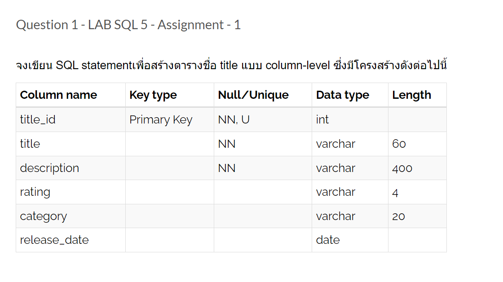
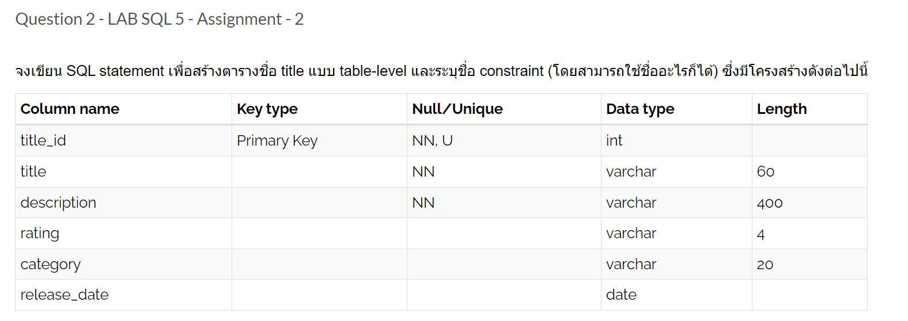

# 2567-LAB02-DDL-Including constraints

## question 1


### code
```sql
create table title (
  title_id		int primary key,
  title			varchar(60) not null,
  description	varchar(400) not null,
  rating		varchar(4),
  category		varchar(20),
  release_date	date
);
```
<br>

## question 2


```sql
create table title (
  title_id		int,
  title			varchar(60) not null,
  description	varchar(400) not null,
  rating		varchar(4),
  category		varchar(20),
  release_date	date,
  	primary key (title_id)
);
```
<br>

## question 3


### code
```sql
create table title_copy (
  copy_id int primary key,
  title_id int not null,
  status varchar(15) not null,
  	foreign key (title_id) references title(title_id)
);
```
<br>

## question 4


### code
```sql
create table title_copy (
  copy_id int,
  title_id int not null,
  status varchar(15) not null,
  	primary key (copy_id),
  	foreign key (title_id) references title(title_id)
);
```
<br>

## question 5


### code
```sql
alter table title
add constraint title_un
    unique (title);
```
<br>

## question 6


### code
```sql
alter table title
modify release_date date not null;
```
<br>

## question 7


### code
```sql
alter table title
add constraint title_cat_fk
    foreign key (category_id) -- here
    references title_category(title_category_id);
```
<br>

## question 8


### code
```sql

```
<br>

## question 9


### code
```sql

```
<br>

## question 10


### code
```sql

```
<br>

## question 11


### code
```sql

```
<br>

## question 12


### code
```sql

```
<br>

## question 13


### code
```sql

```

